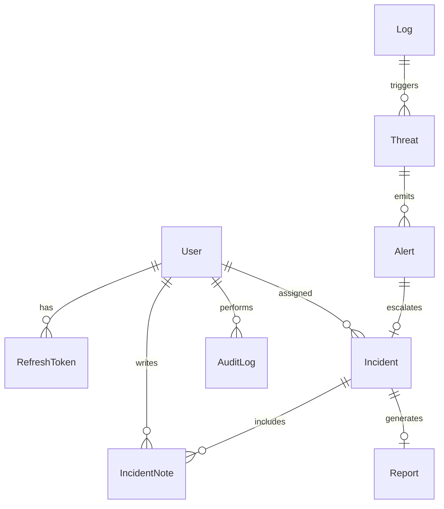

# ER Diagram (Mermaid)

## Normalization
- 1NF: Atomic values and no repeating groups.
- 2NF: Non-key attributes depend on full primary keys.
- 3NF: No transitive dependency between non-key attributes.

## Indexing Strategy
- Frequent filters indexed: `User.email`, `Log(source, createdAt)`, `Log.ipAddress`, `Threat(type, severity, createdAt)`, `Incident(status, createdAt)`.
